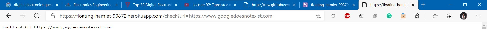

# Website Status Checker
A simple online website status checker made in GoLang.
Simply visit https://floating-hamlet-90872.herokuapp.com/check?url=https://www.google.com, and replace the url parameter with the website link whose status you want to check.

### Built with go Concurrency
It uses go routines to make concurrent GET requests and hence is very performant.

## Screenshots

## To-do

- [ ] Check multiple sites
- [ ] Don't loop too much, causes website to take time to load
- [ ] Improve results, use HTML